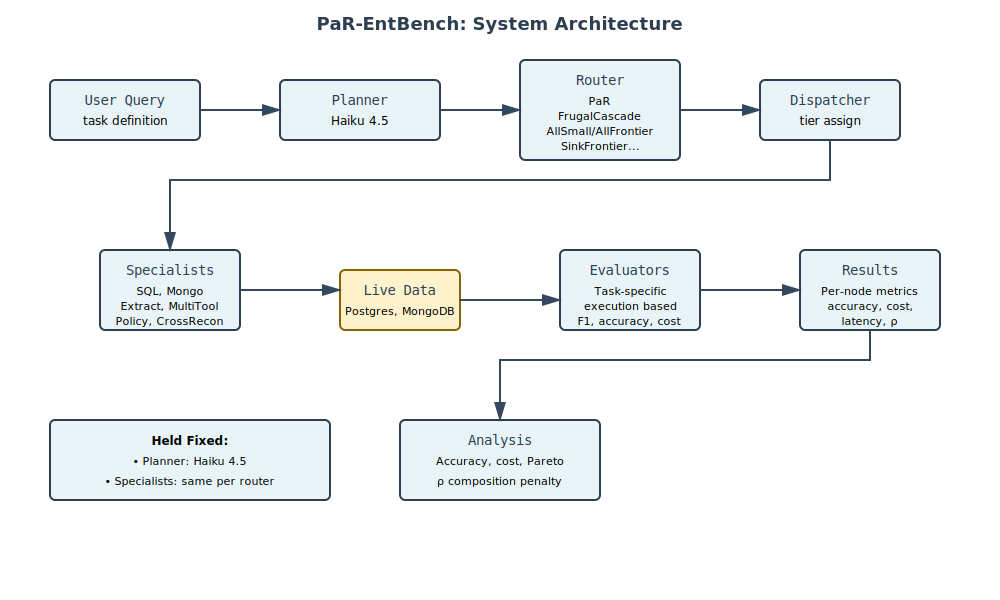
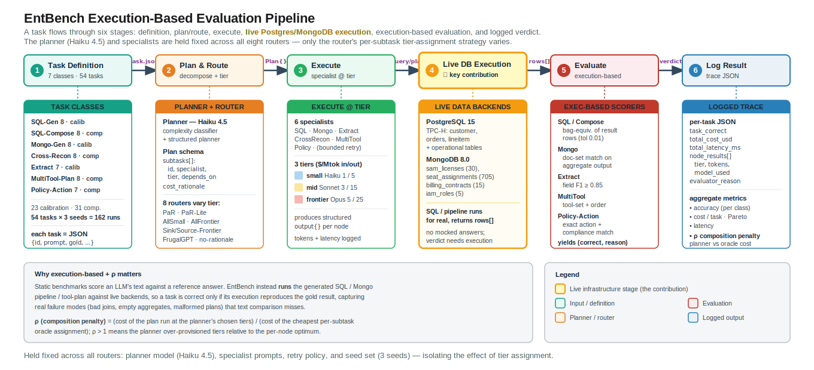

# PaR-EntBench

**Planner-as-Router (PaR)** reference implementation and **EntBench** (Enterprise Task Benchmark) for cost-aware multi-agent LLM workflow evaluation.

[](https://opensource.org/licenses/Apache-2.0)
[](https://www.python.org/downloads/)

## What is this?

PaR is an architectural pattern in which the planner agent simultaneously decomposes a user query into subtasks AND assigns each subtask to a specific LLM tier (small, mid, or frontier) at plan time. This removes the need for a separate routing component and lets cost-accuracy tradeoffs be reasoned about with full query context.

EntBench is a 300-task pilot benchmark across 7 task classes for evaluating cost-aware routing in multi-agent LangGraph workflows. It is the first benchmark specifically designed to measure per-node tier routing decisions and compounding error (ρ) across multi-step agent workflows with structured enterprise data backends.

## Architecture

### Interactive Diagram (draw.io)
[](https://app.diagrams.net/?url=https://raw.githubusercontent.com/vsingh45/par-entbench/main/ARCHITECTURE.drawio)

Click the badge above to open the interactive architecture diagram in draw.io viewer. You can:
- Zoom and pan to explore the diagram
- Click to edit (requires draw.io account or download)
- Export as PNG, PDF, or SVG

### Static Diagram (SVG)


**Diagram Files:**
- **SVG** ([ARCHITECTURE.svg](./ARCHITECTURE.svg)) — Static image, renders in GitHub
- **draw.io** ([ARCHITECTURE.drawio](./ARCHITECTURE.drawio)) — Interactive, editable format
  - Open: [Click here](https://app.diagrams.net/?url=https://raw.githubusercontent.com/vsingh45/par-entbench/main/ARCHITECTURE.drawio) or use the badge above
  - Edit locally: Download and open in [draw.io](https://app.diagrams.net/) or Diagrams app
  - Export: Save as PNG, PDF, SVG after editing

**System Overview:**
- **Planner** (Haiku 4.5 classifier + BatchPlanner) decomposes queries and assigns model tiers
- **8 Routers** (PaR, PaR-Lite, frugal_cascade, etc.) dispatch subtasks with different strategies
- **6 Specialists** (SQL, Mongo, Extract, Cross-Recon, Multitool, Policy) execute subtasks
- **Evaluation** layer tracks cost, accuracy, and composition penalty (ρ)
- **Outputs** in JSON, CSV, and archive formats for analysis

### System Architecture Diagram



**Edit in draw.io:** [Click here](https://app.diagrams.net/?url=https://raw.githubusercontent.com/vsingh45/par-entbench/main/ARCH_SYSTEM.drawio) · **Files:** [SVG](./ARCH_SYSTEM.svg) | [draw.io](./ARCH_SYSTEM.drawio)

*Shows the data flow from user query through planner, routers, specialists, live databases, evaluators, and final analysis. The key insight: **planner (Haiku 4.5) and specialist infrastructure are held fixed** across all routers — only the **tier assignment strategy** changes.*

### Execution-Based Evaluation Pipeline



**Edit in draw.io:** [Click here](https://app.diagrams.net/?url=https://raw.githubusercontent.com/vsingh45/par-entbench/main/EVAL_PIPELINE.drawio) · **Files:** [SVG](./EVAL_PIPELINE.svg) | [draw.io](./EVAL_PIPELINE.drawio)

*The 6-step pipeline that makes EntBench execution-based rather than reference-based: task definition → planner + router → specialist execution → live database hit → task-specific evaluator → logged result. Each task's verdict depends on real Postgres/MongoDB execution, not just model output comparison.*

**Key Results (Haiku Planner, 21 tasks × 8 routers × 3 seeds):**
- Best accuracy: PaR & frugal_cascade at 33.3%
- Best cost efficiency: frugal_cascade at $0.0041/task
- Composition penalty (ρ): PaR 3.33 vs all_frontier 1.27
- Total cost: $5.11 USD

> **Note:** `frugal_cascade` results above predate a fix to its confidence
> scorer (the cascade previously never escalated; see `frugal_cascade` in the
> Routers section). These figures are being regenerated and will change.

## Quick start

### 1. Install

```bash
git clone https://github.com/vsingh45/par-entbench.git
cd par-entbench
pip install -e ".[dev]"
export ANTHROPIC_API_KEY=your_key_here
```

### 2. Start databases

```bash
docker compose up -d
```

Wait ~30 seconds for containers to initialize.

### 3. Seed databases

```bash
python -m entbench.data.postgres.seed
python -m entbench.data.mongo.seed
```

### 4. Verify setup

```bash
par-entbench --verify-setup
```

Expected output:

```
OK: ANTHROPIC_API_KEY is set
OK: Postgres is accessible
OK: MongoDB is accessible
OK: Anthropic API is accessible

All setup checks passed. Ready to run experiments.
```

### 5. Run experiments

**Standalone sweep** (per-node accuracy baseline for ρ, ~$8):

```bash
par-entbench --tasks capability_calibration \
    --routers all_tiers --seeds 1 \
    --output results/standalone/
```

**Pilot run** (100-task sanity check, ~$5):

```bash
par-entbench --tasks pilot_100 \
    --routers all --seeds 1 \
    --output results/pilot/
```

**Full sweep** (overnight, ~$40-55):

```bash
par-entbench --tasks all \
    --routers all --seeds 3 \
    --output results/full/
```

**ρ computation**:

```bash
par-entbench --compute-rho results/full/ \
    --standalone results/standalone/ \
    --rho-output results/rho_analysis.json
```

## Project structure

```
par-entbench/
├── src/
│   ├── par/                      # PaR reference implementation
│   │   ├── types.py              # Pydantic schemas
│   │   ├── planner.py            # Planner agent (Sonnet 4.6)
│   │   ├── dispatcher.py         # Tier dispatcher + bounded retry
│   │   └── observability.py      # Cost tracking + kill-switch
│   ├── baselines/                # 5 baseline routers
│   │   └── routers.py
│   └── entbench/
│       ├── harness.py            # Main experiment runner
│       └── evaluators/           # Class-specific evaluators
├── entbench/
│   ├── config.yaml               # Parameterized defaults
│   ├── tasks/                    # 300 task JSON files by class
│   └── data/                     # DB seed scripts
├── tests/                        # Test suite
├── docs/                         # Dataset card, convention spec, manifest
├── docker-compose.yml            # Postgres + MongoDB containers
├── pyproject.toml                # Project metadata + dependencies
└── results/                      # Output traces (gitignored)
```

## Architecture

PaR routes per-node tier assignments at plan time using a structured `Plan` schema:

```python
class Subtask(BaseModel):
    id: str
    description: str
    specialist: SpecialistType        # sql_gen | mongo_query | extract | ...
    tier: Tier                        # small | mid | frontier
    depends_on: list[str]

class Plan(BaseModel):
    subtasks: list[Subtask]
    cost_rationale: str               # Forces explicit reasoning
```

The planner runs on Claude Sonnet 4.6 across all routers (held constant). The dispatcher routes each subtask to the assigned tier:

| Tier     | Model               | Input / Output (per MTok) |
|----------|---------------------|---------------------------|
| small    | Claude Haiku 4.5    | $1.00 / $5.00             |
| mid      | Claude Sonnet 4.6   | $3.00 / $15.00            |
| frontier | Claude Opus 4.7     | $5.00 / $25.00            |

## Routers

Seven routing strategies are compared:

| Router              | Description                                                  |
|---------------------|--------------------------------------------------------------|
| `par`               | Proposed: planner assigns tier per subtask at plan time     |
| `all_frontier`      | Every node uses Opus 4.7 — accuracy upper bound             |
| `all_small`         | Every node uses Haiku 4.5 — cost lower bound                |
| `sink_frontier`     | Frontier on terminal nodes only                              |
| `source_frontier`   | Frontier on root nodes only                                  |
| `frugal_cascade`    | Small first; an LLM-judge scoring function rates each answer and the cascade escalates to the next tier when confidence is below threshold (FrugalGPT-style cascade with an LLM-judge scorer rather than a trained DistilBERT scorer; the judge's cost is billed) |
| `par_no_rationale`  | Ablation: PaR without cost_rationale (Cross-Recon only)     |

## EntBench task classes

| Class              | Tasks | Type                  | Purpose                                          |
|--------------------|-------|-----------------------|--------------------------------------------------|
| SQL-Gen            | 25    | Capability calibration| Per-tier SQL generation baseline                |
| SQL-Compose        | 25    | Compositional         | SQL feeds downstream LLM-reasoning consumer     |
| Mongo-Gen          | 53    | Capability calibration| Per-tier MongoDB aggregation baseline           |
| Cross-Recon        | 60    | Compositional         | Cross-backend reconciliation (headline class)   |
| Extract            | 54    | Capability calibration| Structured extraction from documents            |
| MultiTool-Plan     | 53    | Compositional         | Plan generation over 25-tool registry           |
| Policy-Action      | 30    | Compositional         | Policy-constrained action selection             |
| **Total**          | **300** | 132 calibration + 168 compositional               |

## Cost controls

Hard kill-switch fires at $75 cumulative API spend. Configurable via `--kill-switch-usd` flag or `cost.kill_switch_usd` in `entbench/config.yaml`.

Expected total spend for full sweep: $50-70 with prompt caching enabled.

## Development

```bash
# Run tests
pytest

# Lint
ruff check src/

# Format
ruff format src/

# Type-check
mypy src/
```

## Citation

If you use PaR or EntBench in your research, please cite:

```bibtex
@article{singh2026par,
  title   = {Planner-as-Router: Cost-Efficient Model Selection in Multi-Agent LangGraph Workflows},
  author  = {Singh, Vivek Kumar},
  journal = {ACM Transactions on Intelligent Systems and Technology},
  year    = {2026},
  note    = {Under submission}
}
```

## License

Apache 2.0 — see [LICENSE](LICENSE).
